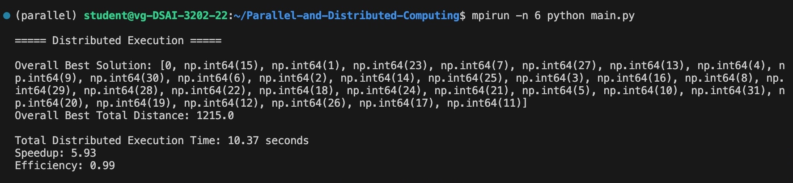
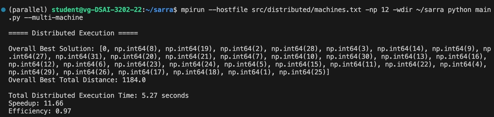

## **Sequential Version Conclusions**

#### `Genetic Algorithm Explanation:`
The script **genetic_algorithm_trial.py** implements a Genetic Algorithm to optimize a delivery route, minimizing the total travel distance. The algorithm follows these steps:

`1. Initialization:`
- Loads a distance matrix representing travel costs between locations.

- Defines key parameters such as population size (10000), mutation rate (0.1), number of generations (500), and stagnation limits (5).

`2. Population Generation:`
- Creates an initial population of routes, ensuring uniqueness and validity.

`3. Evolution Process:`
- **Fitness Evaluation:** Computes the fitness of each route (fitness is defines as the shortest route).

- **Stagnation Handling:** If no improvement is observed for 5 consecutive generations, a new population is generated while keeping the best solution.

- **Selection:** Uses a tournament selection mechanism to pick individuals for reproduction.

- **Crossover & Mutation:** Performs order crossover and mutation to create new routes while balancing exploitation and exploration.

- **Replacement:** The worst-performing routes are replaced with new offspring.

`4. Final Selection:`
- Identifies the best route in the final population and prints the best total travel distance.

#### `Functions Completed:`

`calculate_fitness:`

- Computes the total travel distance of a proposed delivery route.

- If the route includes disconnected nodes (represented with a distance of 100000), a large penalty is applied.

- Returns the negative of the total distance to align with the goal of minimizing distance (since GA selects based on maximum fitness).

`select_in_tournament:`

- Implements tournament selection to pick individuals for crossover.

- Randomly selects a subset of individuals.

- From this subset, selects the individual with the highest fitness.

- Appends the winning individual to the list of selected parents.

#### `Performance Analysis:`

- **Best total distance:** 1131.0

- **Execution time:** 61.50 seconds

**`Run using:`**

<pre><code>python main.py</code></pre>

---

## **Parallel Version Conclusions**

#### `Parallelization Approach:`
The parallel implementation divides the **population** into multiple **chunks** and processes them concurrently using **multiprocessing**. Each chunk evolves independently using a Genetic Algorithm. 

The key parallelized parts are:

`1. Population Chunking:`
- The full population of 10,000 routes is split into 24 chunks distributed across CPU cores.

`2. Parallel Evolution of Chunks:`
- Each chunk is processed independently using Python’s multiprocessing Pool, running the **`evolve_chunk()`** function concurrently. The implementation uses **`starmap_async()`**, allowing for asynchronous execution of the function across multiple processes.

`3. Independent Selection, Crossover, and Mutation:`
- Each chunk undergoes fitness evaluation, selection, crossover, and mutation separately, reducing computational bottlenecks.

`4. Final Selection of the Best Solution:`
- After processing all chunks, the best route is selected from the pool of optimized solutions.

#### `Performance Metrics:`

- **Execution time:** 10.68 seconds

- **Speedup:** 5.76

- **Efficiency:** 96%

**`Run using:`**

<pre><code>python main.py</code></pre>

#### `Performance Analysis:`

- The parallel implementation significantly reduces execution time, achieving a 5.76 speedup.

- The efficiency of 96% indicates that resources were utilized effectively, with minimal overhead.

- The final solution's total distance was 1380.0, showing that the parallel approach maintained a comparable solution quality.

---

## **Distributed Version Conclusions**

#### `Distribution Approach:`

To improve performance, the Genetic Algorithm was parallelized and distributed across 2 machines using MPI. The core approach involved:

`1. Master-Worker Architecture:`

- Rank 0 (Master Process) initializes the population, parameters, and distance matrix.

- It then scatters population chunks to other MPI processes (workers) for parallel evolution.

`2. Parallel Evolution of Chunks:`

- Each worker process evolves a subset of the population using multiprocessing `(Pool.starmap())`.

- Selection, crossover, and mutation are applied independently per worker, reducing computation time.

`3. Gathering and Selecting the Best Route:`

- Each worker returns its best route after local evolution.

- The master process collects all results and determines the global best route.

#### `Performance Metrics:`

##### `Distribution using 1 machine:`

- **Execution time:** 10.37 seconds

- **Speedup:** 5.93

- **Efficiency:** 99%

**`Run using:`**

<pre><code>mpirun -n 6 python main.py</code></pre>

##### `Distribution using 2 machines:`

- **Execution time:** 5.27 seconds

- **Speedup:** 11.66

- **Efficiency:** 97%

**`Run using:`**

<pre><code>mpirun --hostfile src/distributed/machines.txt -np 12 -wdir ~/sarra python main.py --multi-machine</code></pre>

#### `Performance Analysis:`

- The distributed version on a single machine was significantly faster than the sequential version a 5.93 speedup and a 99% efficiency.

- Running across two machines further reduced the execution time to 5.27 seconds and recording a speedup of 11.66 and an efficiency of 97%.

- This confirms that distributing the Genetic Algorithm effectively among multiple machines optimizes performance.

## **Improvements Done**

 **`Hyperparameter Tuning:`**

 - Different generation sizes were tested to balance between convergence speed and solution quality (exploration vs. exploitation trafe-offs).

 **`Nested Multiprocessing within Distributed Architecture:`**

 - The distributed implementation was enhanced by embedding multiprocessing inside each MPI worker process.

 - Each process distributed via MPI further parallelizes the evolution of its assigned chunk using multiple CPU cores.

 **`MPI Execution Separation:`**

 - To avoid performance issues, the main script separated the multiprocessing and MPI executions.
 
 - This prevented unecessary overhead from running multiprocessing under `mpirun` and ensured each method ran in its optimal environment.

---

## **Extended Version Conclusions**

#### `Extended Approach:`

The distributed implementation was reused by adapting it to load the larger dataset **(city_distances_extended.csv)**.

#### `Performance Metrics:`

- **Best total distance achieved:** 404,494.0

- **Execution time:** 6.15 seconds

- **Speedup:** 10.00

- **Efficiency:** 83%

**`Run using:`**

<pre><code>mpirun --hostfile src/distributed/machines.txt -np 12 -wdir ~/sarra python main.py --mpi-extended</code></pre>

#### `Performance Analysis:`

- The extended version demonstrated strong scalability and effective parallel utilization even with a larger dataset, achieving a speedup of 10.00 and an efficiency of 83%.

#### `How can we add more cars to the problem?`

- To add more cars, we would change the solution representation so that each individual is a set of routes—one route per car—instead of a single route. 

- The fitness function would then calculate the total distance by summing the distances of all these routes, while ensuring that every city is visited exactly once across all cars. 

- Additionally, the genetic operators (like crossover and mutation) would need to be adjusted to work with this multi-route structure, ensuring that the offspring remain valid. 

- Essentially, this transforms the problem from a **Traveling Salesman Problem (TSP)** into a **Vehicle Routing Problem (VRP)**.
