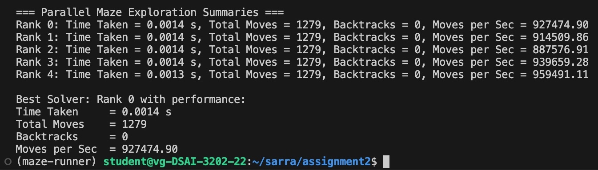
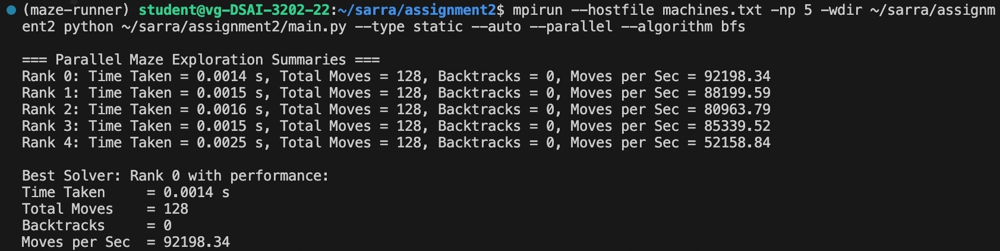
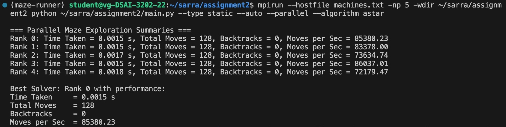
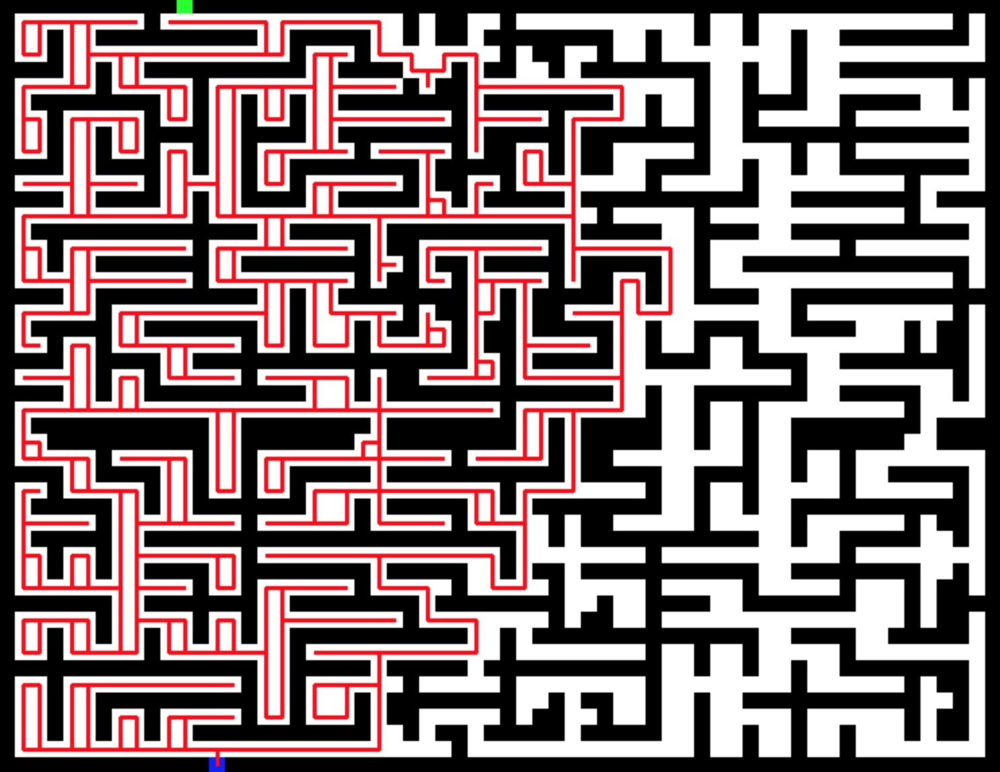
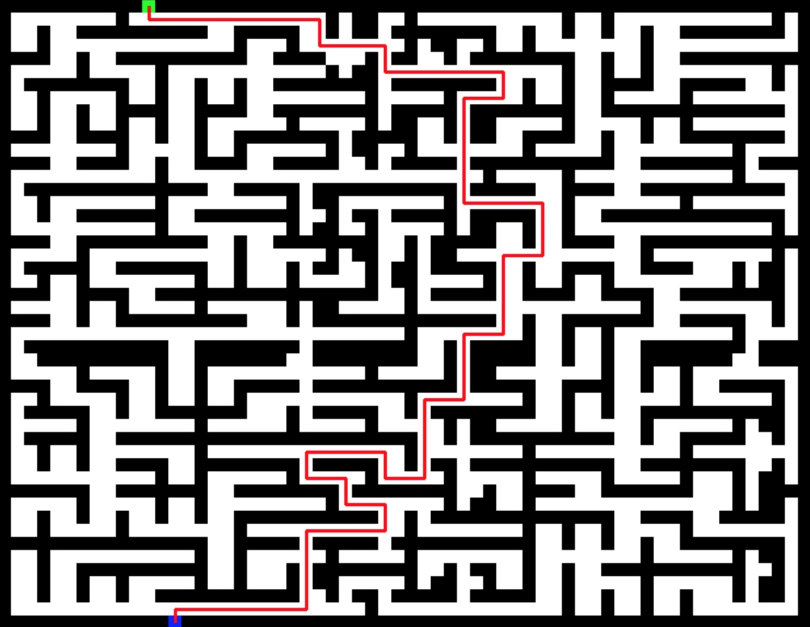

# Maze Exploration Using Search Algorithms

## Question 1

### 1. Algorithm Used: The Right-Hand Rule

The explorer implements the Right-Hand Rule, a classic maze-solving strategy where the agent always keeps its right hand in contact with the wall. 

This ensures that in a simply connected maze (all walls are connected and there are no loops), the explorer will eventually reach the exit.

#### Implementation Analysis

**`Step 0: Initialization:`**

The explorer starts facing right, initialized with:

```bash
self.direction = (1, 0)  # Start facing right
```

**`Step 1: Turn Right and Move Forward If Possible`**

```bash
# Try to turn right first
self.turn_right()
if self.can_move_forward():
    self.move_forward()
    visited.add((self.x, self.y))
```

**Explanation:**

- The explorer first turns 90° to the right.

- It checks if the next cell in that direction is open.

- If yes, it moves forward and records the new position as visited.

**This represents the core of the right-hand rule: always try the path to the right first.**

**`Step 2: If Not, Try Moving Forward (Original Direction)`**

```bash
# If we can't move right, try forward
self.turn_left()
if self.can_move_forward():
    self.move_forward()
    visited.add((self.x, self.y))
```

**Explanation:**

- The explorer reverses its previous right turn to face forward again.

- It checks if it can go straight.

- If yes, it proceeds and records the position.

**This fallback ensures the explorer continues forward if the right path is blocked.**

**`Step 3: If Still Blocked, Try Turning Left`**

```bash
# If we can't move forward, try left
self.turn_left()
if self.can_move_forward():
    self.move_forward()
    visited.add((self.x, self.y))
```

**Explanation:**

- The explorer turns 90° left (relative to its starting direction).

- It checks and moves forward if that direction is valid.

**This allows it to explore side paths if both right and forward are blocked.**

**`Step 4: If All Directions Are Blocked, Turn Around`**

```bash
# If we can't move left, turn around
self.turn_left()
self.move_forward()
visited.add((self.x, self.y))
```

**Explanation:**

- A final `turn_left()` results in a 180° turn from the starting direction (effectively turning around).

- The explorer moves into the only remaining option — potentially backtracking.

**This is a fail-safe to ensure the explorer doesn't get stuck and always keeps moving.**

### 2. Loop Detection Mechanism

To avoid getting stuck in cycles, the explorer uses a loop detection mechanism based on recent movement history.

It keeps track of the last three moves and checks if the same position is repeated. If so, it assumes it's stuck in a loop and triggers backtracking.

#### Implementation Analysis

**`Step 0: Initialize a Move History Buffer`**

```bash
self.move_history = deque(maxlen=3)  # Keep track of last 3 moves
```

**Explanation:**

- A deque (double-ended queue) is used to store the last 3 positions the explorer visited.

- `maxlen=3` means it will always store the most recent three moves only, automatically discarding the oldest one.

**This is a memory-efficient way to monitor recent movements and detect cycles.**

**`Step 1: Update History Every Time the Explorer Moves`**

```bash
current_move = (self.x, self.y)
self.moves.append(current_move)
self.move_history.append(current_move)
```

**Explanation:**

- Every time the explorer moves, it records the new `(x, y)` position.

- The `move_history` deque is updated so that the latest move is added to the memory.

**This keeps the movement history always up-to-date with the most recent 3 steps.**

**`Step 2: Check if the Last 3 Moves Were the Same`**

```bash
def is_stuck(self) -> bool:
   """Check if the explorer is stuck in a loop."""
   if len(self.move_history) < 3:
      return False
   # Check if the last 3 moves are the same
   return (self.move_history[0] == self.move_history[1] == self.move_history[2])
```

**Explanation:**

- This function checks if the last 3 recorded positions are exactly the same.

- If they are, it means the explorer is not making progress — it's “stuck”.

**This simple check effectively detects loops when the explorer keeps going back and forth to the same point.**

### 2. Backtracking Strategy

When the explorer detects it's stuck via loop detection, it initiates a backtracking routine to escape from dead ends or loops.

The backtracking logic retraces steps to the last known position that had multiple unexplored paths, allowing the explorer to continue solving the maze without wasting time in cycles.

#### Implementation Analysis

**`Step 0: Find the Path to Go Back`**

```bash
if not self.backtrack_path:
   # If we don't have a backtrack path, find one
   self.backtrack_path = self.find_backtrack_path()
```

**Explanation:**

- If a backtrack path is not already computed, the explorer calls `find_backtrack_path()` to generate one.

- This path leads back to a point where it had more than one choice (possible unexplored route).

**This ensures the explorer doesn’t just randomly walk backward but chooses a meaningful past location to return to.**

**`Step 1: Follow the Backtrack Path Step-by-Step`**

```bash
if self.backtrack_path:
   # Move to the next position in the backtrack path
   next_pos = self.backtrack_path.pop()
   self.x, self.y = next_pos
   self.backtrack_count += 1
   if self.visualize:
      self.draw_state()
   return True
```

**Explanation:**

- If a valid backtrack path is available, the program:

   - **Retrieves the Next Step:** It pops the next position from the stored backtrack path.

   - **Updates Position:** The explorer moves directly to that cell by updating its (x, y) coordinates.

   - **Tracks Backtracking:** It increments the backtrack_count to record that a backtrack operation occurred.

**This is the actual reversal in progress: the explorer is walking back through a known path toward a better decision point.**

**`Step 2: How find_backtrack_path() Works`**

```bash
for i in range(len(self.moves) - 1, -1, -1):
   pos = self.moves[i]
   ...
   if choices > 1:
      return path[::-1]
```

**Explanation:**

- This method scans previous moves in reverse.

- It looks for the most recent position where more than one move was possible (junction).

- When found, it returns a reversed path (so the explorer can walk back to it step-by-step).

**This logic prevents the explorer from endlessly backtracking.**

**`Step 3: Count Available Choices at a Position`**

```bash
def count_available_choices(self, pos):
   ...
      if self.maze.grid[new_y][new_x] == 0:
         choices += 1
   return choices
```

**Explanation:**

- This helper function checks how many open directions exist from a given cell.

- It’s used by `find_backtrack_path()` to identify whether a position was a junction or just a dead end.

**This is the brain behind identifying strategic backtrack points.**

### 2. Performance Metrics Analysis

At the end of the exploration, the explorer reports the following statistics via `print_statistics()`:

`Total Time Taken:` Total duration from start to reaching the exit (in seconds).

`Total Moves Made:` Number of steps taken by the explorer.

`Backtrack Operations:` Number of times the explorer initiated a backtrack routine.

`Average Moves/sec:` Efficiency of movement calculated as moves / time.

Below is a summary table of the recorded metrics:


**Key Observations:**

**`1. Extremely Fast Solving Time`**

The explorer finished all mazes in near-instant time (≤ 0.01s). This confirms the lightweight nature of the algorithm and efficient execution.

**`2. Move Count Correlates with Maze Size`**

Larger mazes (50x50 static) naturally required more moves. The number of steps increased proportionally to the complexity and area of the maze.

**`3. Zero Backtracking in All Runs`**

The explorer successfully avoided all loops or dead ends, demonstrating the effectiveness of the right-hand rule in the tested mazes.

**`4. High Move Efficiency`**

The implementation is highly optimized for speed in automated mode, with average moves per second exceeding 200,000+.

---

## Question 2

### 1. Parallelization Strategy Overview

- **MPI4Py** was used as the communication layer to run multiple explorer processes across 3 machines.

- Each MPI process executes one instance of a selected maze-solving algorithm.

- The maze is created once by the root process (Rank 0) and broadcasted to all others.

- Each explorer runs independently and records its own statistics.

### 2. Implementation Flow Analysis

**`1. Maze Generation (Rank 0 Only)`**

- The root process (rank 0) generates a single maze instance, ensuring all explorers solve the exact same problem.

**`2. Explorer Execution (All Ranks)`**

- Each process runs the selected algorithm independently on the broadcasted maze, enabling concurrent exploration.

**`3. Result Collection`**

- After solving, each process computes its own metrics (time, moves, efficiency) and sends them to rank 0.

**`4. Summary Reporting (Rank 0 Only)`**

- Rank 0 aggregates the results, displays a comparative summary, and highlights the best-performing explorer.

---

## Question 3

### 1. Rationale for Choosing the Static Maze for Comparison

The **static maze** is used as the primary benchmark for comparison because:

- It provides a consistent and reproducible structure, unlike random or custom mazes which can vary between runs.

- This consistency ensures that all explorers are evaluated fairly on the same layout, complexity, and start/end points.

### 2. Observations from Parallel Execution of the Right-hand Rule Algorithm



**Key Observations:**

**`Logic Remains the Same`**

- All 5 parallel explorers reported identical move counts (1279) and zero backtracks, confirming that parallel execution does not alter the logic of the algorithm.

**`Speed Improvement from Parallelization`**

- The execution time decreased significantly from 0.01s to as low as 0.0013s due to each process running independently and leveraging multiple CPU cores.

- The moves per second metric surged (up to 960,000 moves/sec), as a result of the reduction in computation time.

**`No Better Path Was Found`**

- Despite executing multiple explorers in parallel, the best-performing process still followed the same path with 1279 moves.

- This indicates that no alternative or shorter route was discovered — highlighting the need for enhancement techniques.

**Command to Execute the Parallel Right-Hand Explorer**

```bash
mpirun --hostfile machines.txt -np 5 -wdir ~/sarra/assignment2 python ~/sarra/assignment2/main.py --type static --auto --parallel --algorithm right
```
---

## Question 4

### 1. Identified Limitations in the Right-Hand Rule Explorer

**`1. Excessive Path Length`**

The explorer always tries to turn right first, then forward, then left, and finally turns around — even when the goal is nearby. This strict directional logic, implemented in the `solve()` method, causes the agent to take unnecessarily long routes and often traverse the full perimeter of the maze before reaching the end.

**`2. Ineffective Loop Handling`**

Although a loop detection mechanism was implemented (`is_stuck()` using `move_history`), it only triggers if the same position is repeated three times in a row. This is a reactive approach and does not proactively prevent inefficient revisits to the same regions.

**`3. Naive Backtracking`**

When stuck, the explorer attempts to backtrack using the `find_backtrack_path()` method. However, this backtracking only searches backward through the move history and selects the most recent position with multiple choices — even if it's far from optimal.

**`4. No Global Awareness`**

The agent’s decision-making is entirely based on local surroundings (walls adjacent to the current cell). There is no concept of where the goal is located — which is why the explorer can loop through long detours even if the destination is just a few steps away.

### 2. Proposed Enhancements

**`Enhancement 1. Breadth-First Search (BFS)`**

BFS explores the maze in a proactive and systematic way by checking all possible directions one step at a time before moving deeper. This ensures it always finds the shortest path to the goal without getting stuck or taking long detours.

**`Enhancement 2. A* Search`**

A* is a goal-driven search algorithm that prioritizes paths based on both distance traveled and estimated distance to the goal. This allows it to efficiently guide the explorer toward the exit, avoiding unnecessary exploration.

**`Enhancement 3. Hybrid Algorithm Assignment`**

Instead of assigning the same exploration algorithm to all processes, a hybrid approach distributes different algorithms across multiple MPI ranks. This improves the diversity of exploration strategies and increases the chances of finding a shorter or more optimal route.

### 3. Implementation Analysis

To address the limitations of the right-hand explorer and improve pathfinding efficiency, two enhancements were implemented: Breadth-First Search (BFS) and A* Search.

**`1. Breadth-First Search (BFS)`**

The BFS explorer uses a queue to explore the maze in a **level-by-level manner**:

- The explorer starts from the initial position and places it in a queue.

- It then enters a loop where it dequeues the next position and checks whether it has reached the goal.

- For each current position, it explores all four neighboring cells (up, down, left, right).

- If a neighbor is valid (within bounds, not a wall, and unvisited), it is added to the queue for future exploration.

- A dictionary `came_from` is used to track where each cell was reached from, allowing the path to be reconstructed once the goal is found.

-> Because BFS visits all nearest cells first before going deeper, it guarantees finding the shortest path without needing to backtrack.

**`1. A* Search`**

The A* explorer improves upon BFS by incorporating a heuristic — in this case, Manhattan distance — to prioritize nodes closer to the goal:

- The explorer begins at the start position and places it into a priority queue `(open_set)`, prioritizing positions based on an estimated total cost.

- At each step, it selects the position with the lowest `f-score` — a sum of the distance already traveled`(g_score)` and the estimated remaining distance to the goal (heuristic using Manhattan distance).

- It then checks if the current position is the goal. If so, the search ends.

- Otherwise, it evaluates all four neighboring cells. For each valid neighbor (not a wall), it calculates a new `g_score` (distance from start).

- If this path to the neighbor is shorter than any previously known path, the neighbor is updated in the `came_from` map, and its new `f_score` is calculated and pushed into the `open_set`.

- Once the goal is reached, the `came_from` map is used to reconstruct the optimal path.

**Terminology Explained**

`open_set:` A priority queue of positions to explore next, sorted by their f_score to allow the processing the most promising path first.

`g_score:` The cost of the shortest path from the start node to the current node (i.e., actual distance traveled).

`f_score:` The estimated total cost of the path through the current node — calculated as g_score + heuristic (Manhattan distance to goal).

`Manhattan Distance:` Measures how far a point is from the goal by summing the absolute horizontal and vertical distances.

---

## Question 5

### 1. Performance Comparison

This section compares the performance of the original Right-Hand Rule Explorer with the two enhanced algorithms — Breadth-First Search (BFS) and A* Search — using the static maze as a benchmark. Metrics were collected during parallel execution (5 processes) across 3 machines.

**`BFS Performance Metrics`**



- **Execution Time:** Completion time averaged around 0.0014 to 0.0025 seconds, which is impressively fast despite the algorithm's additional queue operations.
    
- **Moves Made:** All explorers completed the maze in 128 steps, indicating that BFS reliably finds the shortest possible path.

- **Efficiency:** The best-performing process achieved ~92,198 moves/sec, indicating high computational throughput.

- **Backtracking and Consistency:** All processes reported identical move counts and zero backtracks — confirming BFS's natural avoidance of loops and redundant movements (level-by-level exploration).

**Command to Execute the Parallel BFS Explorer**

```bash
mpirun --hostfile machines.txt -np 5 -wdir ~/sarra/assignment2 python ~/sarra/assignment2/main.py --type static --auto --parallel --algorithm bfs
```

**`A* Performance Metrics`**



- **Execution Time:** Time was marginally higher than BFS, averaging around 0.0015 to 0.0018 seconds, due to heuristic calculations (Manhattan distance).

- **Moves Made:** Like BFS, A* also completed the maze in 128 steps, confirming it reached the optimal path.

- **Efficiency:** Best performer reported ~85,380 moves/sec, slightly below BFS.

- **Backtracking and Consistency:** A* also reported identical results across all processes, with zero backtracks. It does not rely on a backtracking mechanism as it always progresses forward using heuristic-guided decisions rather than reversing its path.

**Command to Execute the Parallel A* Explorer**

```bash
mpirun --hostfile machines.txt -np 5 -wdir ~/sarra/assignment2 python ~/sarra/assignment2/main.py --type static --auto --parallel --algorithm astar
```

**`Findings Analysis`**

- Both BFS and A* consistently solved the static maze using only 128 moves, whereas the right-hand explorer required 1279 moves, often circling the perimeter due to its fixed direction logic.

- While all algorithms performed exceptionally fast in parallel, BFS slightly outperformed A* in moves per second, likely due to A*’s additional overhead for heuristic evaluations.

- All three algorithms showed consistent results across all MPI processes, confirming their deterministic behaviors.

**`Path Visualization`**

To visually compare how each algorithm navigates the maze, the explored paths were rendered using `pygame` for the static maze (50x50). The final paths are highlighted in red, showing how each algorithm reached the goal.

### Right-hand Rule Path



- The explorer follows a perimeter-heavy route, often circling walls before reaching the exit.

- Demonstrates lack of global awareness and inefficient routing, even though the exit might be nearby.

### BFS and A-star Path



- Both BFS and A* discover the optimal shortest path.

- Their routes are direct, compact, and free of loops or unnecessary detours.

**`Conclusion`**

While the right-hand rule guarantees eventual exit, it lacks efficiency and adaptability. BFS ensures optimality through exhaustive search, and A* enhances efficiency by prioritizing goal-oriented paths. Both enhancements led to dramatic reductions in move count and higher computational efficiency.

### 2. Trade-offs and Limitations

**`Accuracy vs. Simplicity`**

Algorithms like A* and BFS offer optimal paths but come with higher computational overhead compared to the simpler right-hand rule.

**`Execution Speed vs. Search Quality:`**

Right-hand rule executes quickly but often finds suboptimal paths. In contrast, A* and BFS may take slightly longer but guarantee optimality.

**`Memory Efficiency vs. Global Awareness:`**

The right-hand rule uses minimal memory but lacks global context. BFS and A* consume more memory to track visited nodes and path costs, enabling more informed decisions.

**`Determinism vs. Exploration Diversity:`**

All algorithms produced consistent results on the static maze, confirming their deterministic nature. However, assigning the same algorithm to all processes limits the diversity of search strategies. This highlights the potential value of the hybrid approach proposed in Enhancement 3, where different explorers run different algorithms in parallel.