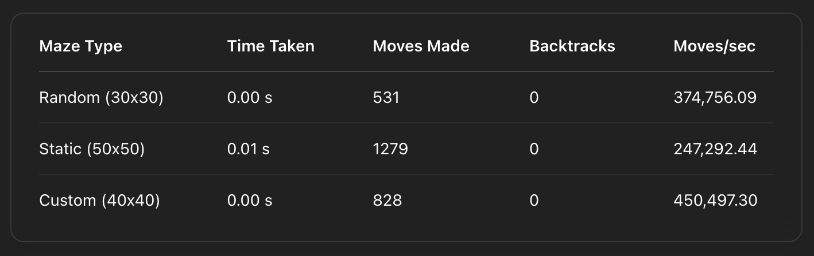

# Maze Explorer Game Answers

## Question 1

### 1. Algorithm Used: The Right-Hand Rule

The explorer implements the Right-Hand Rule, a classic maze-solving strategy where the agent always keeps its right hand in contact with the wall. 

This ensures that in a simply connected maze (all walls are connected and there are no loops), the explorer will eventually reach the exit.

#### Implementation Analysis

`Step 0: Initialization:`

The explorer starts facing right, initialized with:

<pre><code>self.direction = (1, 0)  # Start facing right</code></pre>

The decision-making logic is implemented in the `solve()` method using the next sequence of directional checks.

`Step 1: Turn Right and Move Forward If Possible`

<pre><code>
# Try to turn right first
self.turn_right()
if self.can_move_forward():
    self.move_forward()
    visited.add((self.x, self.y))
</code></pre>

**Explanation:**

- The explorer first turns 90° to the right.

- It checks if the next cell in that direction is open.

- If yes, it moves forward and records the new position as visited.

**This represents the core of the right-hand rule: always try the path to the right first.**

`Step 2: If Not, Try Moving Forward (Original Direction)`

<pre><code>
# If we can't move right, try forward
self.turn_left()
if self.can_move_forward():
    self.move_forward()
    visited.add((self.x, self.y))
</code></pre>

**Explanation:**

- The explorer reverses its previous right turn to face forward again.

- It checks if it can go straight.

- If yes, it proceeds and records the position.

**This fallback ensures the explorer continues forward if the right path is blocked.**

`Step 3: If Still Blocked, Try Turning Left`

<pre><code>
# If we can't move forward, try left
self.turn_left()
if self.can_move_forward():
    self.move_forward()
    visited.add((self.x, self.y))
</code></pre>

**Explanation:**

- The explorer turns 90° left (relative to its starting direction).

- It checks and moves forward if that direction is valid.

**This allows it to explore side paths if both right and forward are blocked.**

`Step 4: If All Directions Are Blocked, Turn Around`

<pre><code>
# If we can't move left, turn around
self.turn_left()
self.move_forward()
visited.add((self.x, self.y))
</code></pre>

**Explanation:**

- A final `turn_left()`` results in a 180° turn from the starting direction (effectively turning around).

- The explorer moves into the only remaining option — potentially backtracking.

**This is a fail-safe to ensure the explorer doesn't get stuck and always keeps moving.**

### 2. Loop Detection Mechanism

To avoid getting stuck in cycles, the explorer uses a loop detection mechanism based on recent movement history.

It keeps track of the last three moves and checks if the same position is repeated. If so, it assumes it's stuck in a loop and triggers backtracking.

#### Implementation Analysis

`Step 0: Initialize a Move History Buffer`

<pre><code>self.move_history = deque(maxlen=3)  # Keep track of last 3 moves</code></pre>

**Explanation:**

- A deque (double-ended queue) is used to store the last 3 positions the explorer visited.

- `maxlen=3` means it will always store the most recent three moves only, automatically discarding the oldest one.

**This is a memory-efficient way to monitor recent movements and detect cycles.**

`Step 1: Update History Every Time the Explorer Moves`

<pre><code>
current_move = (self.x, self.y)
self.moves.append(current_move)
self.move_history.append(current_move)
</code></pre>

**Explanation:**

- Every time the explorer moves, it records the new `(x, y)` position.

- The `move_history` deque is updated so that the latest move is added to the memory.

**This keeps the movement history always up-to-date with the most recent 3 steps.**

`Step 2: Check if the Last 3 Moves Were the Same`

<pre><code>
def is_stuck(self) -> bool:
   """Check if the explorer is stuck in a loop."""
   if len(self.move_history) < 3:
      return False
   # Check if the last 3 moves are the same
   return (self.move_history[0] == self.move_history[1] == self.move_history[2])
</code></pre>

**Explanation:**

- This function checks if the last 3 recorded positions are exactly the same.

- If they are, it means the explorer is not making progress — it's “stuck”.

**This simple check effectively detects loops when the explorer keeps going back and forth to the same point.**

### 2. Backtracking Strategy

When the explorer detects it's stuck via loop detection, it initiates a backtracking routine to escape from dead ends or loops.

The backtracking logic retraces steps to the last known position that had multiple unexplored paths, allowing the explorer to continue solving the maze without wasting time in cycles.

#### Implementation Analysis

`Step 0: Find the Path to Go Back`

<pre><code>
if not self.backtrack_path:
   # If we don't have a backtrack path, find one
   self.backtrack_path = self.find_backtrack_path()
</code></pre>

**Explanation:**

- If a backtrack path is not already computed, the explorer calls `find_backtrack_path()` to generate one.

- This path leads back to a point where it had more than one choice (possible unexplored route).

**This ensures the explorer doesn’t just randomly walk backward but chooses a meaningful past location to return to.**

`Step 1: Follow the Backtrack Path Step-by-Step`

<pre><code>
if self.backtrack_path:
   # Move to the next position in the backtrack path
   next_pos = self.backtrack_path.pop()
   self.x, self.y = next_pos
   self.backtrack_count += 1
   if self.visualize:
      self.draw_state()
   return True
</code></pre>

**Explanation:**

- If a valid backtrack path is available, the program:

   - Takes the next position from the path.
   - Moves the explorer there.
   - Increments the `backtrack_count` for tracking.

**This is the actual reversal in progress: the explorer is walking back through a known path toward a better decision point.**

`Step 2: How find_backtrack_path() Works`

<pre><code>
for i in range(len(self.moves) - 1, -1, -1):
   pos = self.moves[i]
   ...
   if choices > 1:
      return path[::-1]
</code></pre>

**Explanation:**

- This method scans previous moves in reverse.

- It looks for the most recent position where more than one move was possible (junction).

- When found, it returns a reversed path (so the explorer can walk back to it step-by-step).

**This logic prevents the explorer from endlessly backtracking.**

`Step 3: Count Available Choices at a Position`

<pre><code>
def count_available_choices(self, pos):
   ...
      if self.maze.grid[new_y][new_x] == 0:
         choices += 1
   return choices
</code></pre>

**Explanation:**

- This helper function checks how many open directions exist from a given cell.

- It’s used by `find_backtrack_path()` to identify whether a position was a junction or just a dead end.

**This is the brain behind identifying strategic backtrack points.**

### 2. Performance Metrics Analysis

At the end of the exploration, the explorer reports the following statistics via `print_statistics()`:

`Total Time Taken:` Total duration from start to reaching the exit (in seconds).

`Total Moves Made:` Number of steps taken by the explorer.

`Backtrack Operations:` Number of times the explorer initiated a backtrack routine.

`Average Moves/sec:` Efficiency of movement calculated as moves / time.

Below is a summary table of the recorded metrics:

**Key Observations:**

`1. Extremely Fast Solving Time`

The explorer finished all mazes in near-instant time (≤ 0.01s). This confirms the lightweight nature of the algorithm and efficient execution.

`2. Move Count Correlates with Maze Size`

Larger mazes (e.g. 50x50 static) naturally required more moves. The number of steps increased proportionally to the complexity and area of the maze.

`3. Zero Backtracking in All Runs`

The explorer successfully avoided all loops or dead ends, demonstrating the effectiveness of the right-hand rule in the tested mazes.

`4. High Move Efficiency`

The implementation is highly optimized for speed in automated mode, with average moves per second exceeding 200,000+.

## Question 2
